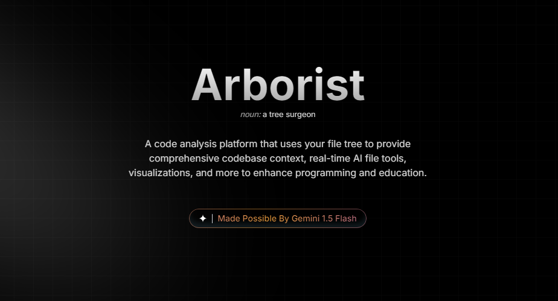

# A note before you start reading.
This repository contains a comprehensive README for Arborist, an AI-driven tool for code analysis, debugging, and visualization. Although the codebase is private, this document outlines its architecture, features, and technical design for those interested in the project.

<h1 align="center">Arborist: Revolutionizing Code Analysis</h1><br>
<p align="center">
  
</p>

<p align="center">
Codebase Context Code Generation, Debugging, and Visualization for Seamless Programming
</p><br>

<p align="center">
  <a href="#"></a>
  <a href="#"></a>
  <a href="#"></a>
  <a href="#"></a>
</p>


<br>
<p align="center">
  
### Table of Contents

1. [Overview](#overview)
2. [Features](#features)
3. [Usage](#usage)
4. [Architecture](#architecture)
5. [Team & Contributors](#team--contributors)

<p/><br>

## Overview

Arborist is a cutting-edge development tool designed to enhance **code generation, debugging, and visualization**. It provides an intuitive way to interact with your codebase, streamlining complex workflows and improving efficiency.

With **intelligent diagram generation**, Arborist helps developers **visualize code structures and flow**, making it easier to navigate, debug, and optimize large projects. The **branching chat system** ensures that every interaction remains contextually aware, allowing users to revisit previous states, explore alternative solutions, and maintain a seamless workflow.

Whether you're tackling a complex codebase or refining existing logic, Arborist empowers developers with **AI-driven insights, real-time visualizations, and an adaptive chat interface** to maximize productivity.


<p/><br>

# Features

## 📌 Full Codebase Context  
Upload entire folders or link GitHub repositories, allowing Arborist to analyze your **entire file tree**. This enables AI-powered **code understanding, modification, and debugging** with full project awareness.  

## 📊 Diagram Generation
Automatically create detailed diagrams to visualize and understand complex codebases. This feature helps you see the bigger picture and navigate your projects with ease.

## 🔄 Prompt Branching  
Navigate conversations like a **version-controlled chat history**.  
- 📌 **Create Nodes** – Every response generates a node for easy reference.  
- 🔄 **Branch Off at Any Point** – Explore multiple solutions without losing progress.  
- ⏳ **Time Machine for Chats** – Revert to any point in the conversation instantly.  

## 📈 Stunning Visualizations  
Gain insights into your **project's history and structure** with AI-driven visual representations.  
- 🔍 **Track Code Changes** – Identify patterns, contributions, and refactors over time.  
- 📁 **Git Integration** – Works with projects containing a `.git` folder to analyze commits.  
- 🖥 **Visual Storytelling** – See the evolution of your codebase at a glance.  

## 🚀 Voice-Activated Code Generation
Harness the power of your voice to generate code quickly and effortlessly. Perfect for speeding up your workflow and making coding more accessible.

<p/><br>

# Architecture

```
$PROJECT_ROOT
├───src
│ ├───app // Core application logic (pages, API, etc.)
│ │ ├───api // Backend API (e.g., chat API)
│ │ ├───chat // Chat interface & settings
│ │ ├───... // Other app-related pages (studio, waitlist, sharing)
│ │ ├───page.jsx // Main application entry
│ │ └───layout.jsx // Page structure
│ ├───components // UI components
│ │ ├───chatui // Chat interface elements
│ │ ├───navbar // Navigation bar
│ │ ├───ui // ShadCN UI components
│ │ ├───... // Other reusable UI components
│ │ └───Resizable.jsx // Resizable chat panel
│ ├───lib // Core utilities and helpers
│ │ ├───hooks // Custom React hooks
│ │ ├───db // Database utilities
│ │ ├───... // Other utility functions (state mgmt, helpers)
```

This is a [Next.js](https://nextjs.org/) project bootstrapped with [`create-next-app`](https://github.com/vercel/next.js/tree/canary/packages/create-next-app).

# System Architecture  

Arborist is designed to enhance **code analysis, generation, and visualization** by integrating AI-driven insights with an intuitive developer interface. The system is structured into multiple components, working together to provide **intelligent automation and deep project awareness**.

## **Core Components**  

### 🖥 **Frontend**  
- Built with **Next.js**, providing an interactive UI for project management, code visualization, and AI-assisted development.  

### ⚙️ **Backend**  
- API layer that handles **code execution, AI processing, and data management**.  

### 🔍 **Command Processor**  
- Parses and processes **user instructions**, converting natural language into structured programming actions.  

### 📊 **Visualization Module**  
- Generates **real-time diagrams** to help developers understand **code structure, execution flow, and dependencies**.  

### 🤖 **AI Code Model**  
- Interprets user inputs to generate, refactor, and debug code dynamically.  
- Summarizes **modifications, optimizations, and bug fixes** for review.  

## **Data Flow**  

1️⃣ **User Interaction** – Users input **natural language commands** or code queries via the frontend.  
2️⃣ **Instruction Processing** – AI **refines instructions** to ensure clarity and intent.  
3️⃣ **Code Execution & Analysis** – The system **generates, debugs, or modifies code** based on user input.  
4️⃣ **Visualization & Feedback** – Results are **displayed, summarized, and visualized** for better understanding.  

## **Tech Stack**  

### **Frontend**  
- **Next.js** – React-based framework for server-side rendering and static site generation.  
- **React** – Core library for building interactive UIs.  
- **Tailwind CSS** – Utility-first CSS framework for styling.  
- **ShadCN** – UI component library built on Radix UI for modern design.  
- **Framer Motion** – Animation library for smooth UI transitions.  

### **Backend & APIs**  
- **Node.js** – JavaScript runtime for server-side execution.  
- **Express.js** – Lightweight backend framework for handling API requests.  
- **MongoDB** – NoSQL database for storing application data.  
- **Google Cloud AI** – Integrates **Google Gemini, Speech-to-Text, and Text-to-Speech APIs** for AI-powered interactions.  

### **AI & Processing**  
- **@ai-sdk/google** – AI SDK for Google Gemini model interactions.  
- **@google-cloud/speech** – Converts audio to text for AI-driven insights.  
- **@google-cloud/text-to-speech** – Generates speech from text for voice feedback.  
- **Mermaid.js & D3.js** – Visualization libraries for generating code structure diagrams.  

<p/><br>

# Usage

### 1️⃣ Setup  
- The user **logs into Arborist** or continues as a **guest**.  

### 2️⃣ Provide Instructions  
- The user **speaks or types a command**, such as:  
  - `"Create a new function called helloWorld"`  
  - `"What's causing the issue on line 234 in example.cpp?"`  
- The **Instruction Elaborator** refines the command by **asking clarifying questions** to ensure precision.  
  - Example: _"What should this function do?"_ or _"Where should it go?"_  
  - For debugging: _"What’s the error message?"_  

### 3️⃣ AI Processing & Response  
- The **Primary Code Model** interprets the refined instructions and **generates relevant code or analysis**.  
- AI ensures **code correctness** by **detecting errors and optimizing output** before finalizing.  

### 4️⃣ Output & Change Summary  
- If Arborist **modifies code**, the **Change Summarizer** provides a **clear summary of edits**.  
- Changes can be **read aloud via TTS** for accessibility and ease of review.  

### 5️⃣ Interactive Visualizations  
- Users can request **real-time visual representations** of their codebase.  
- The **Visualization Module** generates **interactive diagrams**, aiding in:  
  - **Onboarding new engineers** to complex codebases.  
  - **Analyzing recent changes** without manually reviewing large files.  

### 6️⃣ Contextual Prompt Branching  
- Every AI response **creates a node** in a branching history tree, allowing users to:  
  - 🔄 **Revisit any previous point** without losing progress.  
  - 🔍 **Explore different solutions** in parallel branches.  
  - ⏳ **Compare past and new states** of the code effortlessly.  
- This is **especially useful** when:  
  - Reviewing previous configurations **before applying changes**.  
  - Debugging multiple potential solutions **without resetting progress**.  
- Users can seamlessly **jump between branches**, ensuring **no insights are lost** while exploring different coding approaches.  

🚀 **With Arborist, coding is faster, smarter, and more intuitive than ever.**  


## Check Out The Homepage!

If youre curious, our beautiful front page is still up (built by yours truly). Check it out here.
- [Arborist](https://arborist.studio)


# Team & Contributors
Arborist wouldn't have existed without the hard work and dedication of our amazing team and contributors. Below is a list of the key members who have made significant contributions to the project:

## Team
<table>
  <tr>
    <td align="center"><a href="https://github.com/Rivaan-P"><br /><sub><b>Rivaan Patil</b></sub></a><br />Team Lead</td>
    <td align="center"><a href="https://github.com/myudak"><br /><sub><b>Muchammad Yuda</b></sub></a><br />Backend Developer</td>
    <td align="center"><a href="https://github.com/bulkypanda"><br /><sub><b>Arya Gummadi</b></sub></a><br />Full-stack Developer</td>
    <td align="center"><a href="https://github.com/Fustigate8933"><br /><sub><b>Ian Chang</b></sub></a><br />Backend Developer</td>
  </tr>
  <tr>
    <td align="center"><a href="https://github.com/luqmanabdi"><br /><sub><b>Luqman Abdi</b></sub></a><br />Cinematographer</td>
    <td align="center"><a href="https://github.com/coolchigi"><br /><sub><b>Chigozirim Eke</b></sub></a><br />Full-stack Developer</td>
    <td align="center"><a href="https://github.com/bryson32"><br /><sub><b>Bryson Morgan</b></sub></a><br />Lead Front End/Full-Stack Developer</td>
    <td align="center"><a href="https://github.com/setelcorn"><br /><sub><b>Cornelius Pang</b></sub></a><br />Lead Backend Developer</td>
  </tr>
</table>

## Contributors
We would also like to extend our gratitude to the following contributors who have helped improve the project with their valuable input and efforts:

<table>
  <tr>
    <td align="center"><a href="https://github.com/soapss"><br /><sub><b>Sophie Zheng</b></sub></a><br />Backend Developer</td>
    <td align="center"><a href="https://github.com/jessieewoo"><br /><sub><b>Jessie Woo</b></sub></a><br />Cinematography Contributions</td>
    <td align="center"><a href="https://github.com/notcoose"><br /><sub><b>Markus</b></sub></a><br />Backend Contributions</td>
    <td align="center"><a href="https://github.com/ecolijah"><br /><sub><b>Elijah Lopez</b></sub></a><br />Backend Contributions</td>
  </tr>
